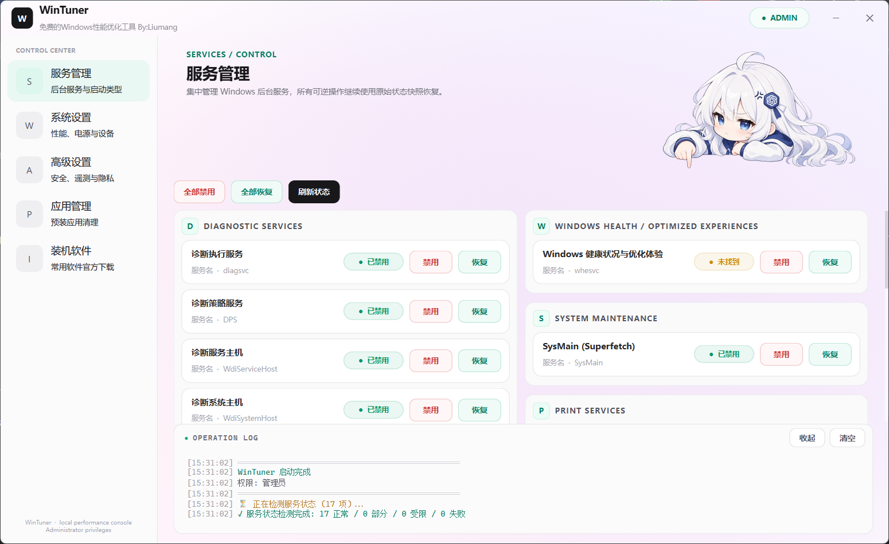

# WinTuner

> 一款由个人开发、基于 **Python + PyQt6** 的 Windows 本地性能调优与系统管理工具。


**项目地址：** https://github.com/Sakura9007/Wintuner

## 界面预览

<p align="center">
  
</p>

WinTuner 将常用的 Windows 服务、性能选项、隐私/遥测、安全策略、预装应用和装机软件入口集中到一个 GUI 中。项目不只是简单拼接批处理命令：对于大量可逆系统修改，会在首次操作前保存原始状态，并统一处理高权限命令、后台检测、恢复和日志输出。

## 功能

WinTuner 当前包含 5 个主要工作区。

### 服务管理

集中检测、禁用和恢复 17 项 Windows 服务，包括诊断服务、SysMain、打印、NFC / Payment、Xbox、Retail Demo、Microsoft Edge 更新等。

服务修改前会记录原始启动类型、延迟启动状态和运行状态；恢复时尽量回到修改前状态，而不是统一设置为某个固定启动类型。

### 系统设置

包含常用性能与桌面设置，例如：

- Power Throttling；
- 高性能 / 卓越性能电源计划；
- 视觉效果与动画；
- 鼠标加速、粘滞键；
- 快速启动与登录启动延迟；
- Windows Update、Delivery Optimization；
- UWP 后台应用、Microsoft Store 后台更新；
- Edge 启动加速与后台运行；
- Search、Widgets、云同步；
- 文件扩展名、隐藏文件、资源管理器默认页；
- Windows 10 经典右键菜单；
- 任务栏相关设置；
- VBS / Credential Guard / HVCI；
- BitLocker 系统盘解密入口；
- 指定 PnP 设备管理。

### 高级设置

面向更底层的安全、隐私与遥测项目，包括：

- Windows Defender、防火墙、SmartScreen；
- UAC、AMSI、WPBT；
- HVCI / 易受攻击驱动程序阻止列表；
- BCD 动态时钟 / 平台时钟；
- 内存压缩、Spectre V2 缓解；
- Windows Copilot、Recall 与部分 AI 功能；
- 活动历史、位置、个性化体验、广告推荐；
- DiagTrack、CEIP、错误报告及多项遥测策略；
- Synaptics 可疑残留扫描与保守清理。

### 应用管理

可检测并批量处理常见 Windows / Microsoft 预装 AppX 与部分 OEM / 第三方 AppX。

卸载流程会先盘点所有用户安装包与系统镜像中的 Provisioned Package，并识别 Windows 标记为不可移除的系统保护包；保护包会被安全跳过，不通过修改 ACL 等方式强制删除。

### 装机软件

提供少量常用软件的官方网站入口，例如 Steam、图吧工具箱、MSI Afterburner。该页面只打开官方网站，不负责静默下载安装第三方程序。

## 使用前请注意

WinTuner 会直接修改 Windows 服务、注册表、计划任务、BCD、电源配置以及部分系统安全策略，因此建议在了解对应选项含义后再操作。

尤其需要注意：

- 部分修改需要重启 Windows 才会完全生效；
- Defender、防火墙、UAC、AMSI、代码完整性、VBS、Spectre 缓解等属于高风险设置；
- AppX 批量卸载后，部分应用需要通过 Microsoft Store 或官方方式重新安装；
- 不同 Windows 版本、OEM 镜像和策略环境可能表现不同；
- 第一次使用时建议先创建系统还原点，并优先逐项修改。

## 系统要求

- Windows 10 / Windows 11
- 管理员权限
- Python 3.13（推荐）
- PyQt6 >= 6.8.0

WinTuner 使用 `winreg`、Windows API、PowerShell、DISM、BCDEdit、Service Control Manager 等 Windows 专用能力，因此不支持 Linux 或 macOS。

## 从源码运行

```powershell
git clone https://github.com/Sakura9007/Wintuner.git
cd Wintuner

py -3.13 -m venv .venv
.\.venv\Scripts\Activate.ps1

python -m pip install --upgrade pip
pip install -r requirements.txt
python main.py
```

程序启动时会自动申请管理员权限。

如果 PowerShell 不允许激活虚拟环境，也可以直接使用：

```powershell
.\.venv\Scripts\python.exe main.py
```

## Nuitka 构建

发布版使用 Nuitka `standalone` 模式构建。

先安装构建依赖：

```powershell
python -m pip install --upgrade nuitka
```

然后在项目根目录执行：

```powershell
.\build.ps1
```

`build.ps1` 会自动从 `wintuner.__version__` 读取版本号，避免源码版本和 EXE 文件版本不一致。当前版本 `2.0.0` 会写入 Windows 文件版本 `2.0.0.0`。

脚本使用的核心 Nuitka 参数与发布配置如下：

```powershell
python -m nuitka `
    --standalone `
    --windows-console-mode=disable `
    --enable-plugin=pyqt6 `
    --windows-icon-from-ico=1.ico `
    --windows-product-name="WinTuner Pro" `
    --windows-product-version=2.0.0.0 `
    --windows-file-version=2.0.0.0 `
    --windows-file-description="WinTuner Pro - Windows Performance Optimizer" `
    --windows-company-name="LiuMangStar Internet" `
    --windows-uac-admin `
    --output-filename=WinTunerPro `
    --output-dir=dist `
    --assume-yes-for-downloads `
    main.py
```

如果根目录存在 `1.ico`，`build.ps1` 会自动带上应用图标；如果没有，则给出提示并使用默认图标继续构建。

`dist/` 已加入 `.gitignore`，构建产物不需要提交到源码仓库。需要发布 EXE 时，可以把构建结果压缩后上传到 GitHub Releases。

## 项目结构

```text
Wintuner/
├─ main.py                         # 程序入口 / Nuitka 构建入口
├─ build.ps1                       # Windows 构建脚本
├─ requirements.txt                # Python 运行依赖
├─ LICENSE                         # MIT License
├─ assets/
│  └─ screenshots/
│     └─ services.png              # README 界面截图
└─ wintuner/
   ├─ app.py                       # Qt 初始化、UAC、单实例、退出清理
   ├─ core/
   │  ├─ admin.py                  # 管理员权限与 Named Mutex
   │  ├─ commands.py               # 系统命令白名单 / PowerShell 执行
   │  ├─ constants.py             # 服务、AppX、设备、任务常量
   │  ├─ native.py                # Windows Service 原生 API
   │  ├─ paths.py                 # 资源与日志路径
   │  ├─ runtime.py               # 线程池、锁与状态 generation
   │  ├─ state.py                 # 注册表 / 计划任务恢复事务
   │  └─ workers.py               # Qt 后台任务封装
   ├─ service_management/          # 服务管理
   ├─ system_settings/             # 系统设置
   ├─ advanced_settings/           # 安全、隐私、遥测等高级设置
   ├─ application_management/      # AppX 管理
   ├─ software_installation/       # 官方软件下载入口
   └─ ui/                          # 主窗口、页面、组件与样式
```

## 核心设计

### 可逆操作先保存原始状态

WinTuner 对大量注册表、计划任务和服务修改保存原始状态。恢复数据主要位于：

```text
HKEY_LOCAL_MACHINE\SOFTWARE\WinTuner\Recovery
```

服务恢复会尽量还原原始启动类型、延迟启动和运行状态，而不是简单“恢复成自动”。

### 高权限命令统一执行

外部高权限命令经过统一执行器，并限制为明确的 Windows 系统组件，例如 `sc`、`net`、`bcdedit`、`schtasks`、`dism`、`powercfg` 和 PowerShell。

命令默认使用 `shell=False`；PowerShell 脚本通过 EncodedCommand 传递，减少复杂引号和本地代码页造成的解析问题。

### 修改串行、检测并行

系统修改任务强制串行，避免多个高权限操作同时写系统状态；状态检测则可以并行执行，提高界面刷新速度。

每次系统修改都会推进状态 generation，旧检测任务如果晚于修改完成返回，其结果会被丢弃，避免过期状态覆盖新状态。

### UAC 与单实例保护

WinTuner 启动时会申请管理员权限，并检查提升前后的 Windows 用户是否一致，避免 HKCU 设置被写到另一个管理员账户。

程序还使用 Windows Named Mutex：

```text
Local\WinTuner_SingleInstance
```

确保同一会话只运行一个实例。

## 日志

启动错误和部分底层诊断会写入：

```text
%TEMP%\WinTuner_error.log
```

遇到问题时，可以连同 Windows 版本、执行的功能项和相关日志一起提交到 GitHub Issues：

https://github.com/Sakura9007/Wintuner/issues

## 作者

WinTuner 是个人开发项目。

- GitHub：**Sakura9007**
- Repository：https://github.com/Sakura9007/Wintuner

如果这个项目对你有帮助，可以给仓库一个 Star；发现 Bug 或兼容性问题，直接开 Issue 即可。

## License

本项目使用 [MIT License](./LICENSE) 开源。

```text
Copyright (c) 2026 Sakura9007
```

在保留版权声明和许可证文本的前提下，你可以使用、复制、修改、合并、发布和分发本项目代码。

## Disclaimer

本项目用于 Windows 系统管理、实验和个人调优。不同硬件、Windows 版本、驱动、OEM 镜像、企业策略和安全软件环境可能产生不同结果。

使用者需要自行评估修改系统安全、更新、磁盘加密和底层启动配置带来的风险。项目按 MIT License “AS IS” 提供，作者不对因使用本项目造成的系统异常、数据丢失、安全能力下降或第三方软件兼容性问题承担责任。
